markdown
# Chidi-AI-Startup Pull requests, push, merge and conflict in git main and branches using TOM and Jerry as branch example.

## Collaboration Workflow

This documents the Git collaboration workflow for Tom and Jerry’s contributions (May 2025).

### Tom’s Contribution
- **Branch**: `tom-feature`
- **Changes**: Added welcome message to `index.html, using 'clone .' git add . , git commit, git pull, git pull, git checkout tom,git push origin tom-feature etc`.
- **PR-Pull request**: 
- **PR-Pull request atep by step**: 
- **PR**: [Tom’s PR](https://github.com/Dowlib1/Chidi-AI-Startup/pull/)
- **Screenshots**: (https://github.com/Dowlib1/Chidi-AI-Startup/Mergeimages/merg/TomPullStep1.png)
- **Screenshots**:
 - 
   - 
   - 
   - 
  - 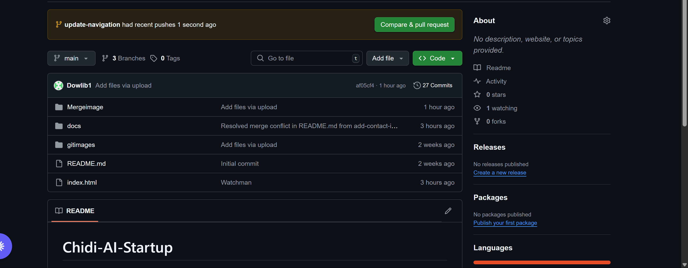
  - 
  - 

### Jerry’s Contribution
- **Branch**: `jerry-feature`
- **Changes**: Added contact link, resolved conflict.
- **PR**: [Jerry’s PR](https://github.com/Dowlib1/Chidi-AI-Startup/)
- **Screenshots**:
  - 
  - 
  - 
  - 
  - - [PR Creation]
  - 
- 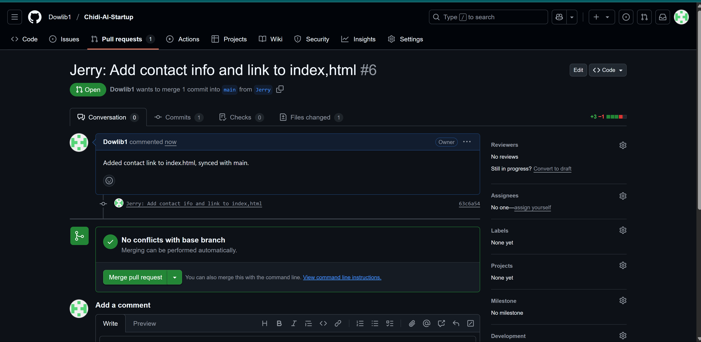
- 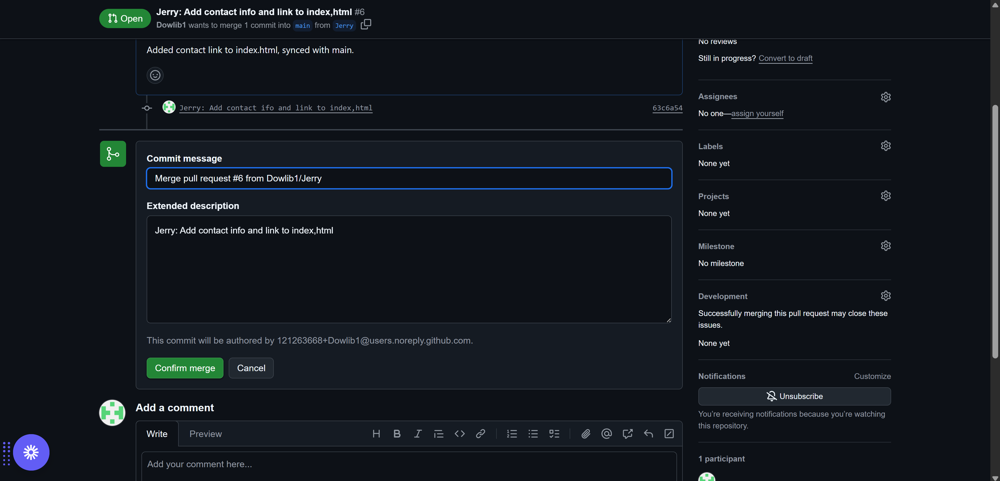
- 
- 
  - 
  - 
  - 
  - 
  - 
  - 

This section documents all images in the `docs/gitimages/` directory, showcasing features and updates for the Chidi-AI-Startup project.

## Screenshots

- **Git Dashboard**: Overview of the repository dashboard.
  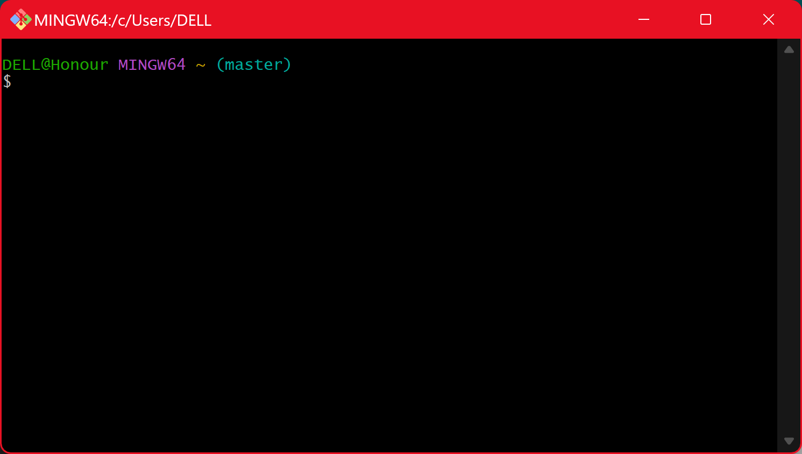
- **Installing Git**: Installation process for Git.
  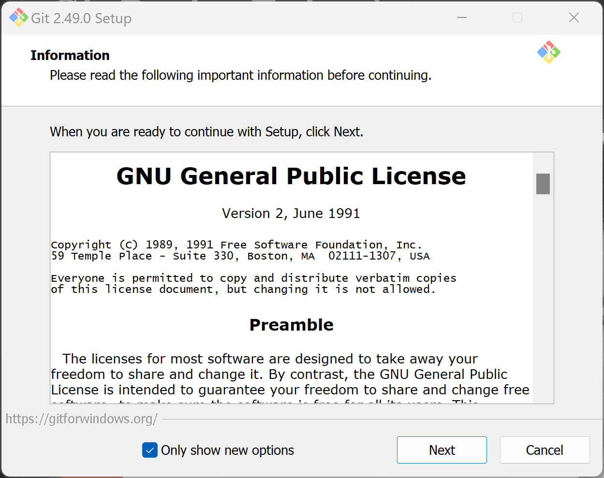
- **Git Commit**: Committing changes in Git.
  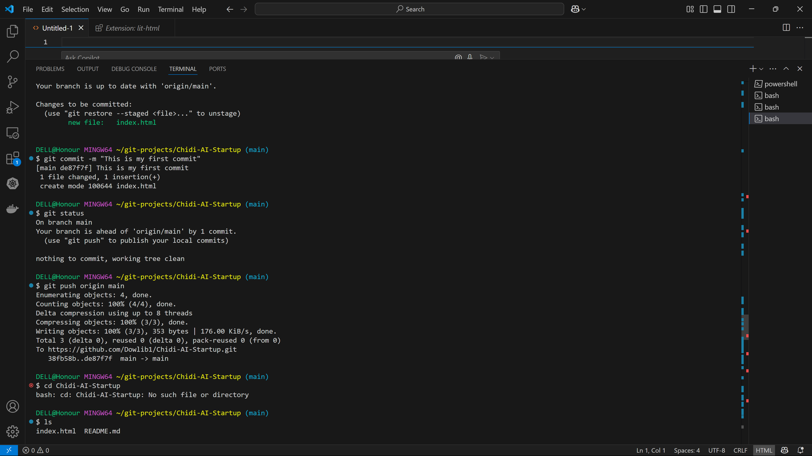
- **Git Add Status**: Adding files and checking status.
  
- **Git Checkout**: Demonstrates branch switching.
  
- **Git Clone**: Cloning the repository.
  
- **Git Code**: Code view in the repository.
  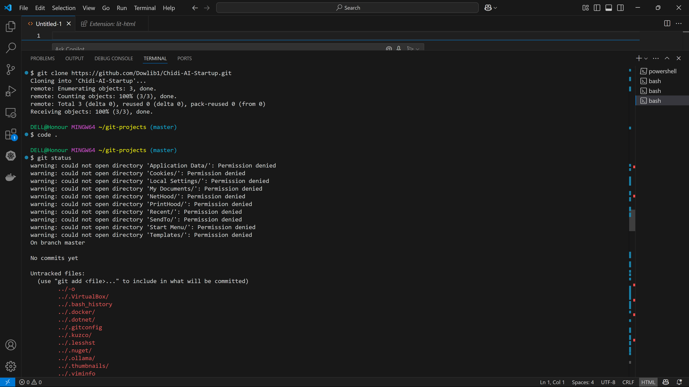
- **Git Comment 1**: First comment example in Git.
  
- **Git Comment 2**: Second comment example in Git.
  
- **Git Comment 3**: Third comment example in Git.
  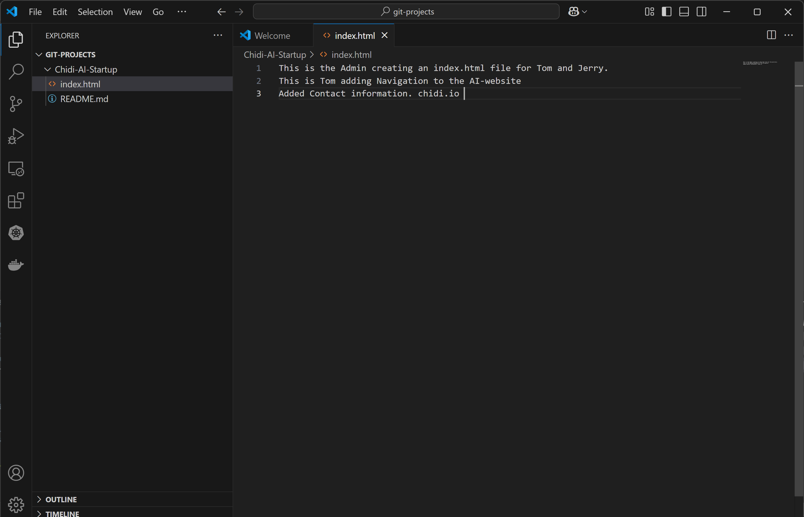
- **Git Download**: Downloading the repository.
  
- **Git Index HTML**: Index.html file view.
  
- **Git Install**: Git installation steps.
  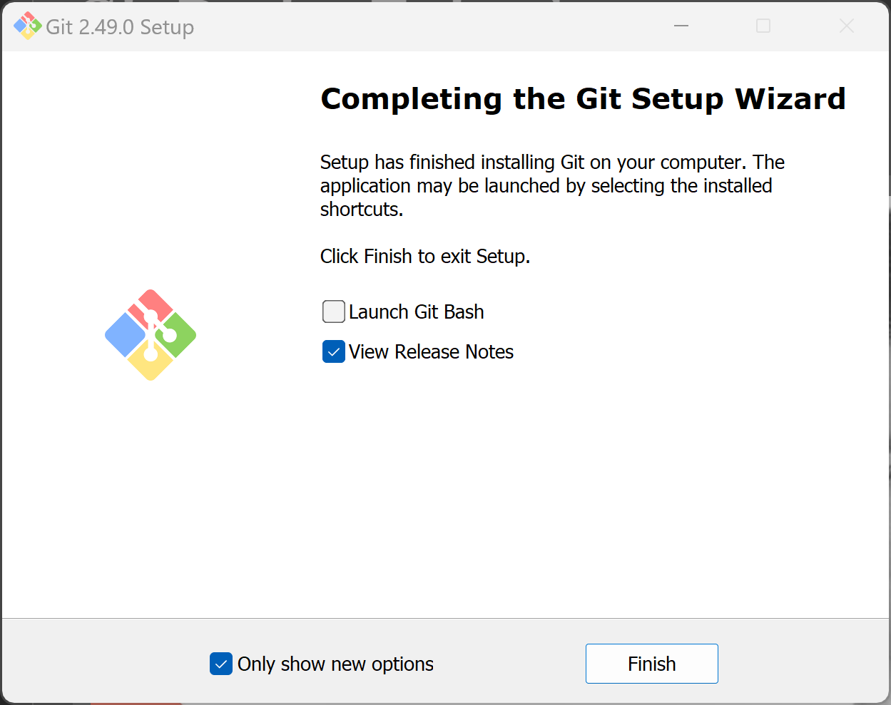
- **Git Posh**: Git with PowerShell integration.
  
- **Git Repository**: Repository overview.
  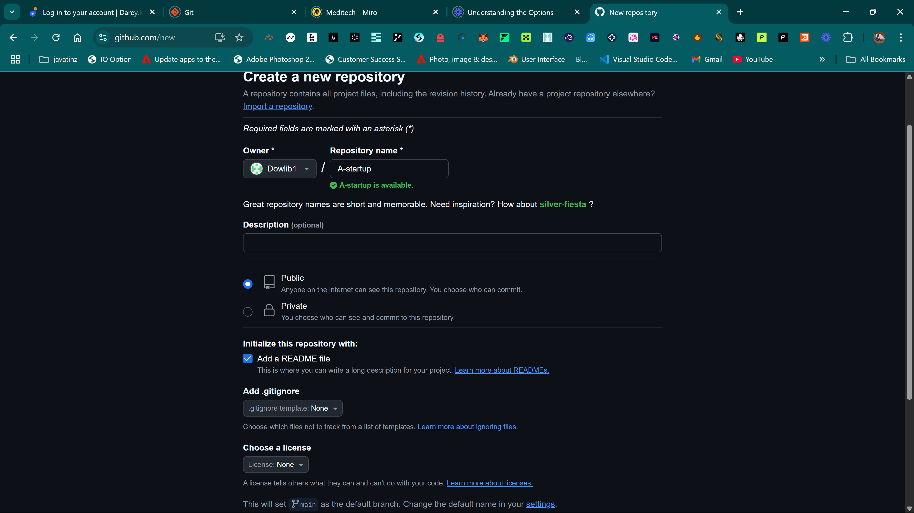
- **Git Repository 2**: Alternate repository view.
  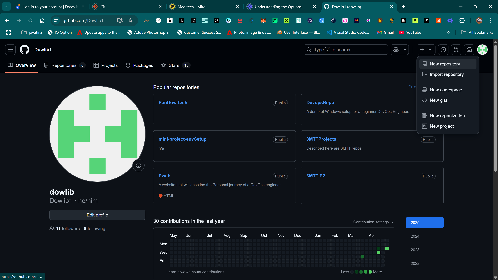
- **Git Repository 3**: Another repository view.
  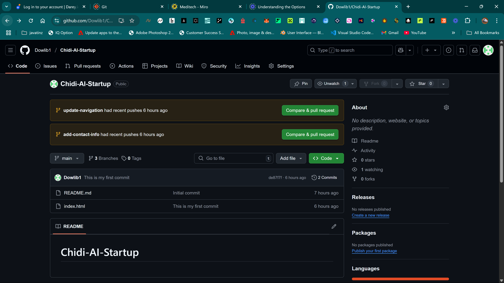
- **Git Repo Main**: Main branch view.
  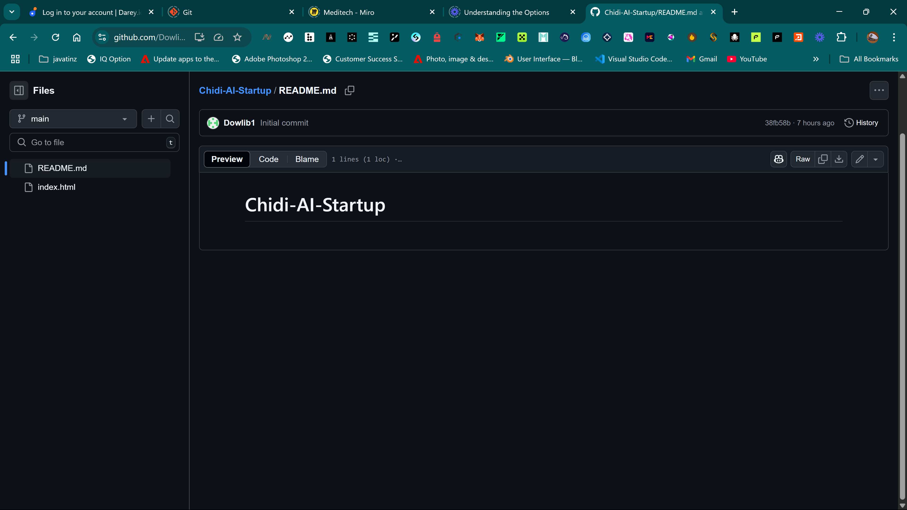
- **Git Web**: Web interface of the repository.
  
- **Push Origin**: Pushing changes to origin.
  
  - **Merge Navigation Update**: Updated navigation UI.
  
- **Merge Contact Info**: Enhanced contact section.
  
  - **Merge Navigation Update**: Updated navigation UI.
  
- **Merge Contact Info**: Enhanced contact section.
  
  - **Merge Navigation Update**: Updated navigation UI.
  
- **Merge Contact Info**: Enhanced contact section.
  
  - **Merge Navigation Update**: Updated navigation UI.
  
- **Merge Contact Info**: Enhanced contact section.
  
