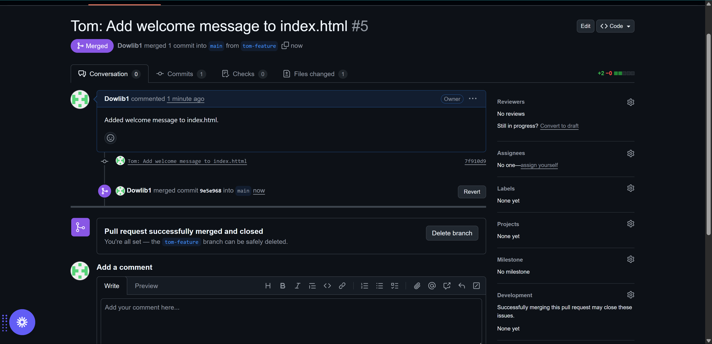

markdown
# Chidi-AI-Startup Pull requests, push, merge and conflict in git main and branches using TOM and Jerry as branch example.

## Collaboration Workflow

This documents the Git collaboration workflow for Tom and Jerry’s contributions (May 2025).

### Tom’s Contribution
- **Branch**: `tom-feature`
- **Changes**: Added welcome message to `index.html, using 'clone .' git add . , git commit, git pull, git pull, git checkout tom,git push origin tom-feature etc`.
- **PR-Pull request**
- 
- **PR-Pull request atep by step**:
- 
- **PR-Pull Request**: [Tom’s PR](https://github.com/Dowlib1/Chidi-AI-Startup/pull/)
- **Screenshots**: (https://github.com/Dowlib1/Chidi-AI-Startup/Mergeimages/merg/TomPullStep1.png)
- **Screenshots**:
 - 
  - 
- 
- 
  - 
  - 
  - 

### Jerry’s Contribution
- **Branch**: `jerry-feature`
- **Changes**: Added contact link, resolved conflict.
- **PR**: [Jerry’s PR](https://github.com/Dowlib1/Chidi-AI-Startup/)
- **Screenshots**:
- 
 - 
 - 
 - 
 - - [PR Creation]  - 
- 
- 
- 
- 
 - 
 - 
 - 
 - 
 - 
- 

This section documents all images in the `docs/gitimages/` directory, showcasing features and updates for the Chidi-AI-Startup project.

## Screenshots

