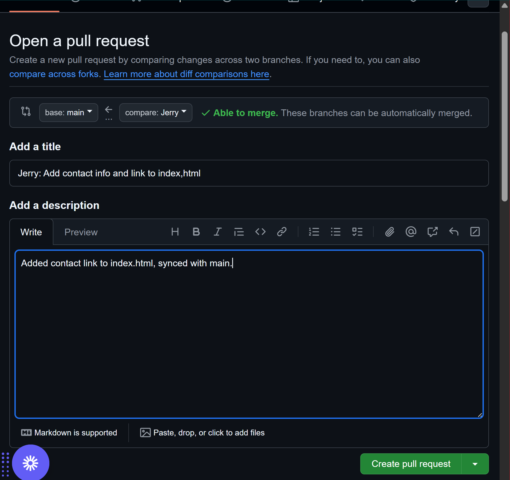

# Chidi-AI-Startup

Welcome to **Chidi-AI-Startup**!

This project is a hands-on demonstration of Git and GitHub collaboration workflows, created for the 3MTT miniProject 2 assignment. It uses the story of Tom and Jerry as branching examples to illustrate real-world version control, pull requests, and conflict resolution.

---

## 🚀 Project Overview

- **Purpose:** Demonstrate Git and GitHub usage, including branching, merging, conflict resolution, and collaborative workflows.
- **Stack:** Basic HTML, Git, GitHub.

---

## 🏗️ Collaboration Workflow

### Tom’s Contribution

- **Branch:** `tom-feature`
- **Tasks:**  
  - Added welcome message to `index.html`
  - Demonstrated branch creation, staging, committing, pulling, pushing, and PR creation
- **Git Commands Used:**
  - `git clone .`
  - `git add .`
  - `git commit`
  - `git pull`
  - `git checkout tom`
  - `git push origin tom-feature`
- **Pull Request:**  
  [Tom’s PR](https://github.com/Dowlib1/Chidi-AI-Startup/pull/)
- **Screenshots:**
  - 
  - 
  - 
  - 
  - 

---

### Jerry’s Contribution

- **Branch:** `jerry-feature`
- **Tasks:**  
  - Added contact link
  - Resolved merge conflict in collaboration with Tom
- **Pull Request:**  
  [Jerry’s PR](https://github.com/Dowlib1/Chidi-AI-Startup/)
- **Screenshots:**
  - 
  - 
  - 
  - 
  - 
  - 
  - 
  - 
  - 
  - 
  - 

---

## 🧑‍💻 Git Commands Reference

- `git clone https://github.com/Dowlib1/Chidi-AI-Startup.git`
- `git add .`
- `git commit -m "Add initial files"`
- `git remote -v`
- `git push origin main`
- `git commit -m "Update README with screenshots"`
- `git checkout <branch>`
- `git rebase`
- `git merge`

---

## 📷 Screenshots

Here are some key steps and their screenshots:

- 
- 
- 
- 
- 
- 
- 
- 
- 
- 
- 
- 
- 
- 

> All images for workflow and conflict resolution are available in the `Mergeimage/merg/` and `docs/gitimages/` directories.

---

## 📚 Documentation

- All Git command outputs and screenshots are included above for quick reference.
- The project demonstrates step-by-step how to:
  - Branch and collaborate
  - Create and review pull requests
  - Resolve merge conflicts

---

## 🌐 Repository

[https://github.com/Dowlib1/Chidi-AI-Startup](https://github.com/Dowlib1/Chidi-AI-Startup)

---

*Happy collaborating! For questions or contributions, open an issue or a pull request!*
