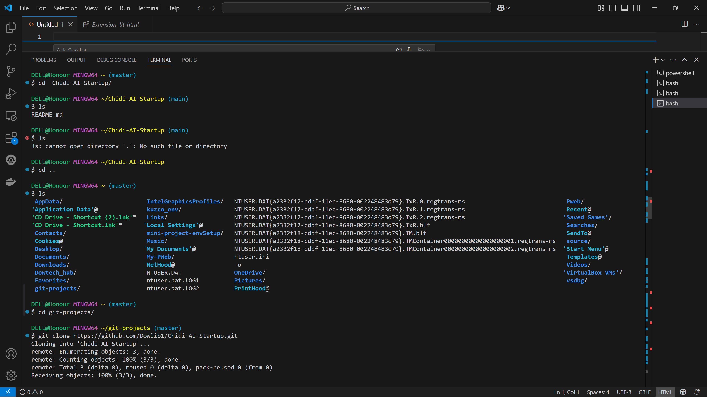
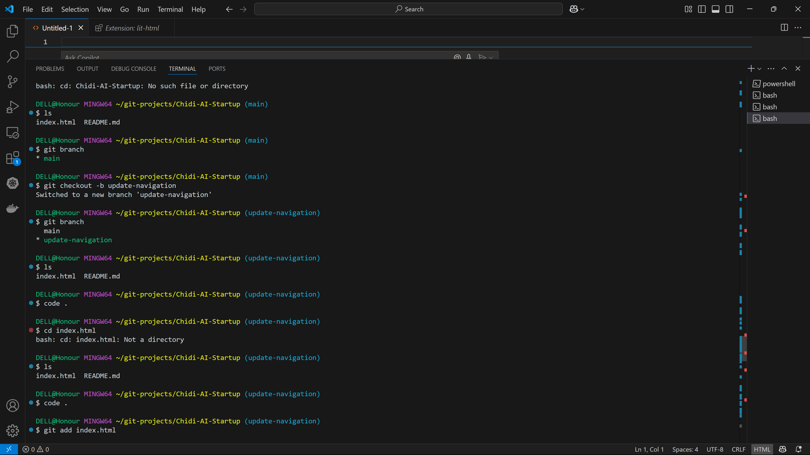
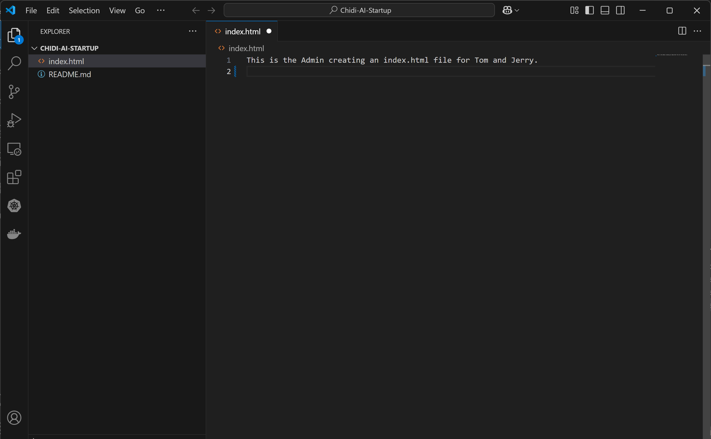
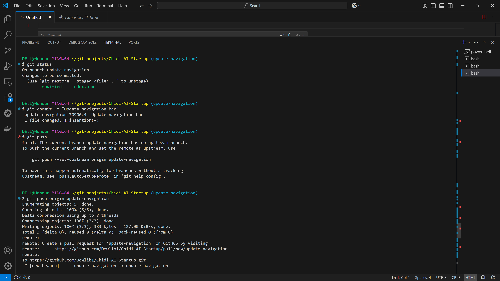

# Chidi AI Startup

## Project Overview
This repository demonstrates Git and GitHub usage for the 3MTT miniProject 2 assignment, including basic HTML, file management, and version control.

## Assignment Results
This section documents the Git commands and screenshots for the assignment.

### Git Commands Executed
- Cloned repository: `git clone https://github.com/Dowlib1/Chidi-AI-Startup.git`
- Staged files: `git add .`
- Committed files: `git commit -m "Add initial files"`
- Verified remote: `git remote -v`
- Pushed to GitHub: `git push origin main`
- Added documentation: `git commit -m "Update README with screenshots"`

### Screenshots
- 
- 
- 
- 
- 
- 
- 
- 
- 
- 
- 
- 
- 
- 
- 
- 
- 
- 
- 
- 
- 
- 
- 
- 
- 
- 
- 
- 

### Repository URL
[https://github.com/Dowlib1/Chidi-AI-Startup](https://github.com/Dowlib1/Chidi-AI-Startup)
